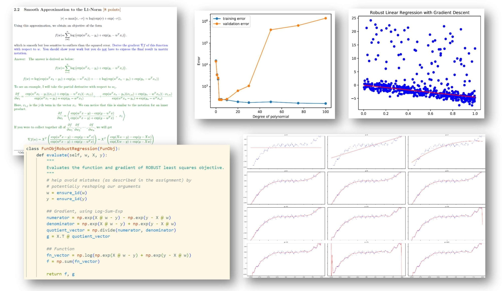
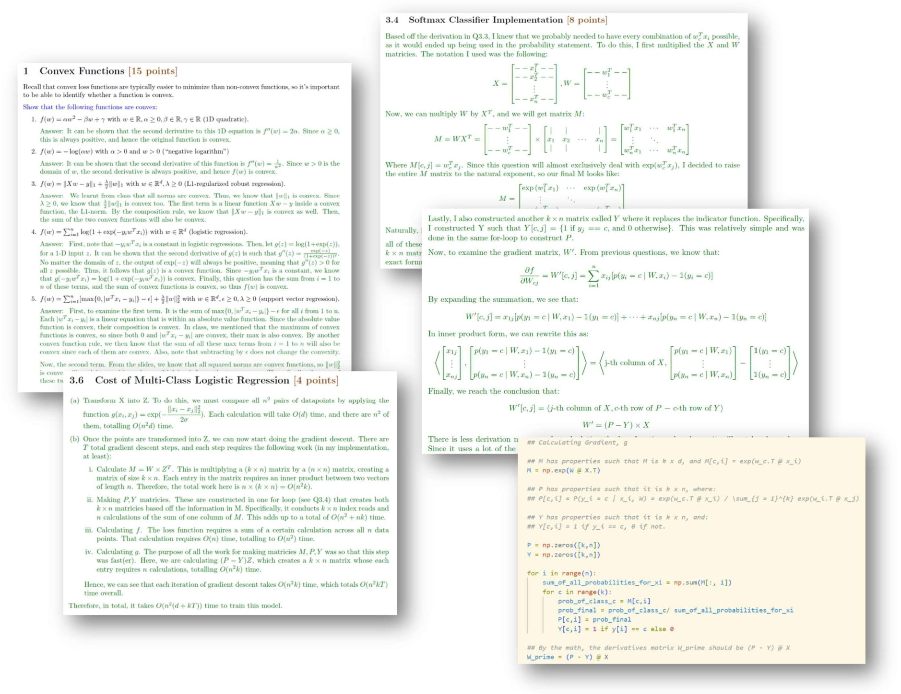
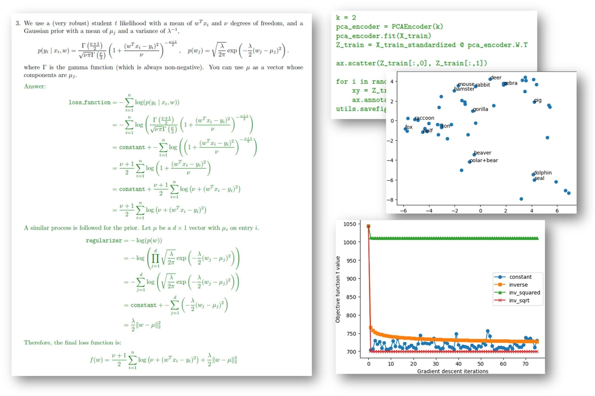
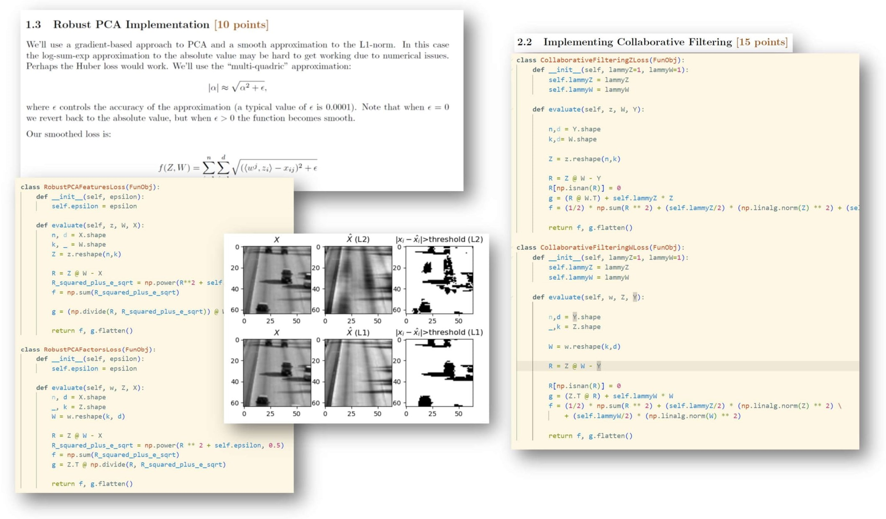

# Machine Learning Implementation & Applications
A collection of from-scratch implementations of traditional ML models, built independently during UBC CPSC 340: Machine Learning and Data Mining.

## Simple Regression
### Linear Regression, Robust Linear Regression,  Polynomial Bases

## Further Regression
### Logistic Regression, Softmax Classifiers, Convexity

## Math-y
### PCA, MAP Estimation, Stochastic Gradient Descent

## Advanced Unsupervised Learning
### Robust PCA, Collaborative Filtering, Neural Networks
