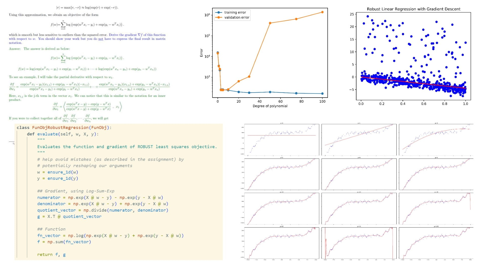

# Machine Learning Implementation & Applications
A collection of from-scratch implementations of traditional ML models, built independently during UBC CPSC 340: Machine Learning and Data Mining.

## Linear Regression

