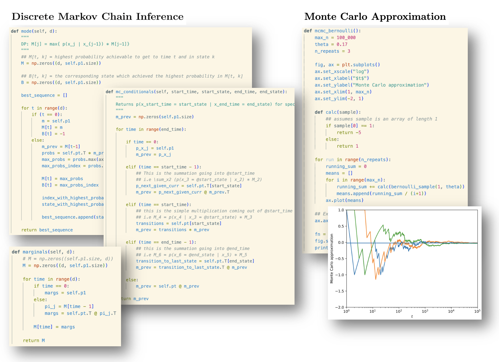

# Machine Learning Implementation & Applications
A collection of from-scratch implementations of traditional ML models, built independently during UBC CPSC 340: Machine Learning and Data Mining.

## Simple Regression
### Linear Regression, Robust Linear Regression,  Polynomial Bases

## Further Regression
### Logistic Regression, Softmax Classifiers, Convexity

## Advanced Unsupervised Learning
### Robust PCA, Collaborative Filtering

## Miscellaneous
### PCA, MAP Estimation, Stochastic Gradient Descent

## Markov Chains & Monte Carlo Methods
### Ancestral sampling, Marginal and Conditional Probabilities, Viterbi Decoding, Monte Carlo Approximation

## Generative Classifiers
### Gaussian Discriminant Analysis, Discriminant Analysis with Student-t

## Bayesian Methods
### Vector-quantized Naive Bayes, Posterior-predictive Probability

## Deep Learning
### Neural networks, 10-way MNIST Classification, ConvNet